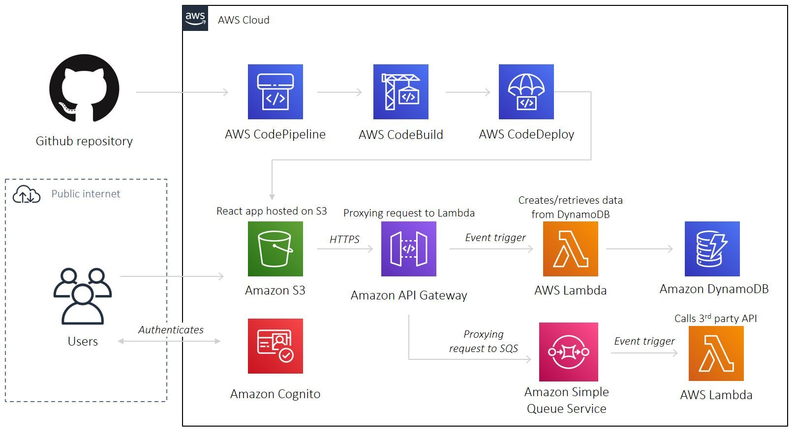

[](https://GitHub.com/kyle-lanier-mscs/ama) [](https://github.com/kyle-lanier-mscs/ama/blob/master/LICENSE)

[](https://GitHub.com/kyle-lanier-mscs/)

[](http://ForTheBadge.com)
[](https://GitHub.com/)

# AWS Serverless React App

A reference project to deploy a serverless, full-stack React app onto AWS with Terraform. Inspired by [this](https://www.youtube.com/watch?v=Bro0uFVDrWY) YouTube tutorial by Code Engine

A to-do list app which allows users to create, and read to-do's from DynamoDB



## License

This (small) repository is published under the terms of the [MIT license](https://github.com/kyle-lanier-mscs/ama/blob/master/LICENSE) (file [LICENSE.txt](LICENSE.txt)).
© [Kyle Lanier](https://GitHub.com/kyle-lanier-mscs), 2020-21.


## Pre-requisite

- Make sure you have installed [Terraform](https://learn.hashicorp.com/tutorials/terraform/install-cli), [AWS CLI](https://docs.aws.amazon.com/cli/latest/userguide/install-cliv2-mac.html#cliv2-mac-prereq), [NodeJs](https://nodejs.org/en/download/), and configured a `default` AWS CLI profile (see doc [here](https://docs.aws.amazon.com/cli/latest/userguide/cli-configure-quickstart.html#cli-configure-quickstart-profiles))

```bash
terraform -help # prints Terraform options
which aws # prints /usr/local/bin/aws
aws --version # prints aws-cli/2.0.36 Python/3.7.4 Darwin/18.7.0 botocore/2.0.0
node --version # prints v14.17.0
aws configure # configure your AWS CLI profile
```

## Configuration

- Create a Github project, and generate a personal access token (see doc [here](https://docs.github.com/en/github/authenticating-to-github/creating-a-personal-access-token))

- Create an [S3 bucket](https://www.terraform.io/docs/language/settings/backends/s3.html) to store Terraform state. Populate bucket name in `01-main.tf`

- Populate `terraform.tfvars`:

```bash
default_region      = "<YOUR_AWS_DEFAULT_REGION>"
github_username     = "<YOUR_GITHUB_USERNAME>"
github_project_name = "<YOUR_GITHUB_PROJECT_NAME>"
app_name            = "<GIVE_YOUR_APP_A_NAME!>"
environment         = "<ENVIRONMENT_NAME>"
```

## Local Github Setup

- Initialize an empty GitHub project on your local machine

- Point your local repo to your new GitHub project

- Add the codebase to local repo and push to your project in GitHub

```bash
rm -rf .git # remove the existing GitHub project history
git init # initialize an empty local GitHub project
git remote add origin https://github.com/<your github user id>/<your github repository name>.git
git config user.email "<your github user email address>"
git config user.name "<your github user name>"
git branch -M master # create a master branch for codepipeline
git add -a # add the codebase
git commit -M "something from nothing"
git push -u origin master
```

## Local Frontend Setup

- Download the necessary npm packages

- Build the react app

- Run and test the react app

```bash
npm run-script install
npm run-script build
npm run-script start
npm run-script test
```

## Deploy

```bash
cd deploy # change to deploy directory
terraform init # initialises Terraform
terraform apply # deploys AWS stack. See output for app url
terraform destroy # destroys AWS stack
```

- When prompted for `github_token`, provide the value and hit Return. Alternatively, create a [local environment variable](https://www.terraform.io/docs/language/values/variables.html#environment-variables) named `TF_VAR_github_token`

## Contributing

- Pull requests are welcome. For major changes, please open an issue first to discuss what you would like to change.

- Please make sure to update tests as appropriate.

- If you find this project helpful, please give a :star:

----

## Links

<h2 align="center">
:dizzy: Ask me anything! :sparkles:<br><br>

<a href="../../issues/new">:speech_balloon: Ask a question</a> &nbsp;&nbsp;&nbsp;&nbsp;&nbsp;&nbsp;&nbsp;&nbsp; <a href="../../issues?q=is%3Aissue+is%3Aclosed+sort%3Aupdated-desc">:book: Read questions</a>
</h2>

I get questions by email, occasionally. This way anyone can read the answer!

[](https://GitHub.com/kyle-lanier-mscs/ama)

Anything means *anything*. Personal questions. Money. Work. Life. Code.
Cooking. Traveling. Teaching. Whatever. :joy:

### :memo: Guidelines

 - :mag: Ensure your question has not already been answered.
 - :memo: Use a succinct title and description.
 - :bug: Bugs & feature requests should be opened on the relevant issue tracker (i.e., on the issue tracker of the corresponding [Bi[GitHub](https://github.com/kyle-lanier-mscs/) repository).
 - :blush: Be nice, civil and polite ([as always](http://contributor-covenant.org/version/1/4/)).
 - :heart_eyes: If you include at least one emoji in your question, the feedback might come faster!
